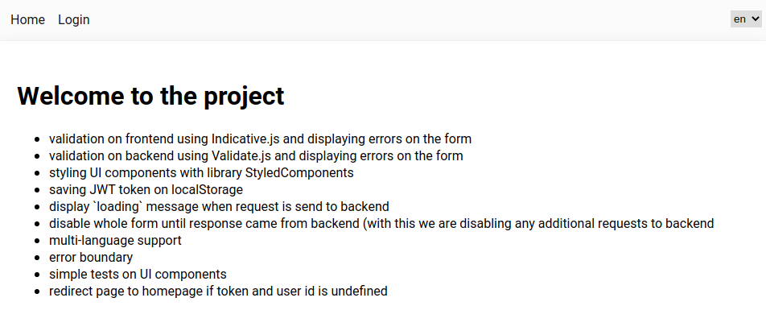

<h2>About the project</h2>
Application with basic functionalities was made in 20 hours to try new React framework - Nextjs and fetching data from Graphql database. 
Application has three containers: Homepage, Login and About page (that shows details of logged user).
<br /><br />


_Image 1 application homepage_


_Image 2 details when user is logged_

On login page, validation was implemented on frontend using Indicative.js and backend using Validate.js. Also error messages are supported that was caused by backend or form itself. Form can not be submitted twice if any request already send to backend to process. Until response came back, new action on the form can be triggered.  

_Image 3 validation on the form_

And some small UX, loader shows to indicate users that something is happening in the background.


<br />
<h2>Installation</h2>

> Node.js: you have to have at least 12.x version

To run project:

1. clone repo
2. install packages from package.json
   and before you run the code, run

```bash
yarn install
or
yarn
or
npm install
```

3. run the code

```bash
npm run dev
# or
yarn dev
```

Other CLI commands

```bash
yarn test // run tests of UI components
yarn format // run prettier of .js files (React.js)
yarn lint // run eslint
```

For this project, I have used:

<ul>
   <li>Next.js</li>
   <li>React.js (using hooks)</li>
   <li>Node.js</li>
   <li>Styled-components (CSS)</li>
   <li>PropTypes</li>
   <li>Apollo (for GraphQl)</li>
   <li>Prettier</li>
   <li>ESLint</li> 
   <li>ES6</li>
   <li>i18n (for multi-language)</li>
</ul>

> Spend time for this project: 20 hours.
